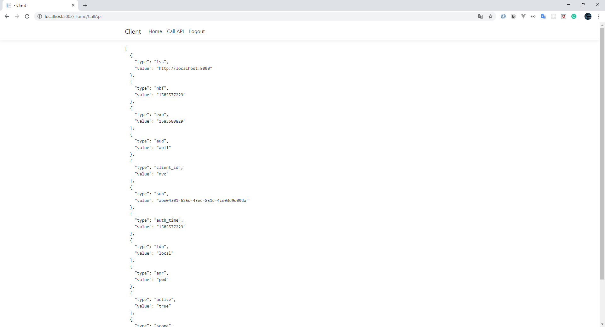

# IdentityServer4.Study

## Overview
We have an IdentityServer, Client, Api, Client.
The client calls IdentityServer for getting token then the Client use this token to call API.
I use a reference token type in these projects.
When using reference tokens - IdentityServer will store the contents of the token in a data store and will only issue a unique identifier for this token back to the client. The API receiving this reference must then open a back-channel communication to IdentityServer to validate the token.


See [here](https://identityserver4.readthedocs.io/en/latest/) for more information about IdentityServer4

## Introduction
We have 3 projects in this repository
##### IdentityServer: [\Server\IdentityServer.sln](https://github.com/nkmnhan/IdentityServer4.Study/tree/master/Server)
This is an identity server base on IdentityServer4 and uses SQL Server to store configuration and identity users
##### Client: [\Client\Client.sln](https://github.com/nkmnhan/IdentityServer4.Study/tree/master/Client)
This is an MVC project play a role as a client
##### Api: [\Api\Api.sln](https://github.com/nkmnhan/IdentityServer4.Study/tree/master/Api)
This is an API project provides API for client

## Preparation
##### Prerequisite:
>You must have SQL SERVER installed on your computer.

## Configuration Reference Token

### IdentityServer
##### Client
AccessTokenType = AccessTokenType.Reference


#### Api Resource and Api Secrete


#### Identity Server 4 Setting


### Client


### API


## Before Run
Check connection to SQL SERVER in `appsetting.json` of the IdentityServer project:
```
"ConnectionStrings": {
    "IdentityUserConnection": "Data Source=.;database=IdentityUsers;trusted_connection=yes;",
    "IdentityConfigConnection": "Data Source=.;database=IdentityConfig;trusted_connection=yes;"
  }
```
Then you run all 3 projects

OK - let’s get started!


## Run the applications
Go to [http://localhost:5002](http://localhost:5002) then login with default account.

>The default users are alice/bob, password: Pass123$


Login Success


Call API



Verify introspection log in IdnetityServer project


## REFERENCE DOCUMENTS AND LIBRARIES
>I have some clones of IdentityServer4 source code so you can reference and debug easily:
- IdentityServer4.Clone - v.3.1.2
- IdentityServer4.AccessTokenValidation.Clone - v3.0.1
- IdentityModel.AspNetCore.OAuth2Introspection.Clone - v4.0.1

>I was reference these documents and libs

IdentityServer4: [https://identityserver4.readthedocs.io/](https://identityserver4.readthedocs.io/)

IdentityServer4.AccessTokenValidation: [https://github.com/IdentityServer/IdentityServer4.AccessTokenValidation](https://github.com/IdentityServer/IdentityServer4.AccessTokenValidation)

IdentityModel.AspNetCore.OAuth2Introspection: [https://github.com/IdentityModel/IdentityModel.AspNetCore.OAuth2Introspection](https://github.com/IdentityModel/IdentityModel.AspNetCore.OAuth2Introspection)
